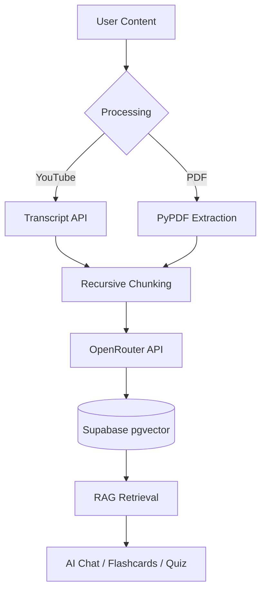

# Study. — AI Learning Assistant

**Study.** is a premium, full-stack AI-powered learning platform designed to transform passive content into active mastery. By combining Retrieval-Augmented Generation (RAG) with a high-fidelity interactive UI, it allows users to convert any YouTube video or PDF document into a structured learning environment.


## ✨ Features

- **📺 Video-to-Knowledge**: Paste any YouTube URL to extract the transcript and index it for learning.
- **📄 Document Intelligence**: Upload PDFs to instantly chunk and embed technical documentation, lecture notes, or textbooks.
- **🧠 Interactive Flashcards**: Study with 3D flipping cards generated from your content, featuring progress tracking and tactile GSAP animations.
- **📝 Multiple-Choice Quizzes**: Test your knowledge with dynamically generated quizzes, real-time feedback, and comprehensive result summaries.
- **💬 Grounded AI Chat**: Ask questions directly to your content. Our RAG pipeline ensures answers are based *only* on your uploaded materials, preventing hallucinations.

## 🎨 Design Philosophy

**Study.** isn't just a tool; it's an experience. We've replaced generic UI patterns with a **Minimalist Botanical** aesthetic:
- **High-Fidelity Motion**: Powered by **GSAP**, featuring smooth staggered entrances, tactile 3D card flips, and celebratory reward animations.
- **Premium Typography**: A curated hierarchy using *Syne* for bold headers and *DM Sans* for crisp readability.
- **Dynamic Theming**: Fully optimized Light and Dark modes with soft grain overlays and CSS-grid background systems for a textured, desktop-app feel.

## 🛠️ Tech Stack

| Layer | Technology |
|---|---|
| **Frontend** | [Next.js 15](https://nextjs.org/) (App Router), [GSAP](https://gsap.com/) for animations, Vanilla CSS with HSL variables. |
| **Backend** | [FastAPI](https://fastapi.tiangolo.com/) (Python) for asynchronous, high-performance API handling. |
| **Database** | [Supabase](https://supabase.com/) (PostgreSQL) + **pgvector** for semantic similarity search. |
| **AI Engine** | [OpenRouter](https://openrouter.ai/) (`meta-llama/llama-3.1-8b-instruct` / `openai/text-embedding-3-small`). |
| **Processing** | `LangChain` for recursive character chunking and semantic splitting. |

## 🏗️ Architecture



### The RAG Pipeline
1. **Ingestion**: Documents are split into 800-character chunks with a 150-character overlap to preserve semantic context.
2. **Indexing**: Each chunk is converted into a 1536-dimensional vector and stored in Supabase with session isolation.
3. **Retrieval**: User queries are embedded in real-time. We perform a cosine-similarity search to pull the top 5 most relevant context chunks.
4. **Augmentation**: Context is injected into a strict system prompt, ensuring the AI remains grounded in the source material.

## 🔄 Model Flexibility

**Study.** is built with a provider-agnostic architecture. Using **OpenRouter** as a bridge, you can switch between state-of-the-art models from OpenAI, Anthropic, and Google without modifying the core codebase.

### Switching Chat Models
To use a different model for chat, flashcards, and quizzes, simply update the `CHAT_MODEL` environment variable:
- **GPT-4o Mini:** `openai/gpt-4o-mini`
- **Gemini 1.5 Flash:** `google/gemini-flash-1.5`
- **Claude 3.5 Sonnet:** `anthropic/claude-3.5-sonnet`
- **Llama 3.1 8B (Default):** `meta-llama/llama-3.1-8b-instruct`

### Switching Embedding Models
While chat models are plug-and-play, switching embedding models requires a small database adjustment to match the model's output dimensions:
1. **Update `EMBEDDING_MODEL`** (e.g., `google/text-embedding-004`).
2. **Adjust Supabase Schema**: If the new model uses a different dimensionality (e.g., Gemini is 768, OpenAI is 1536), you must update the `embedding` column in your `documents` table:
   ```sql
   ALTER TABLE documents ALTER COLUMN embedding TYPE vector(768);
   ```

---

## 🚀 Setup & Installation

### 1. Prerequisites
- Node.js 18+ & npm
- Python 3.10+
- A Supabase project with `pgvector` enabled (run `supabase_schema.sql` in the SQL editor).

### 2. Backend Setup
```bash
cd backend
cp .env.example .env
# Fill in your OPENROUTER_API_KEY, SUPABASE_URL, and SUPABASE_KEY
python -m venv venv
source venv/bin/activate # or venv\Scripts\activate on Windows
pip install -r requirements.txt
uvicorn main:app --reload --port 8000
```

### 3. Frontend Setup
```bash
cd frontend
npm install
npm run dev
```
Visit `http://localhost:3000` to start learning.

---

*Developed with focus on RAG precision, interactive pedagogy, and motion design excellence.*
